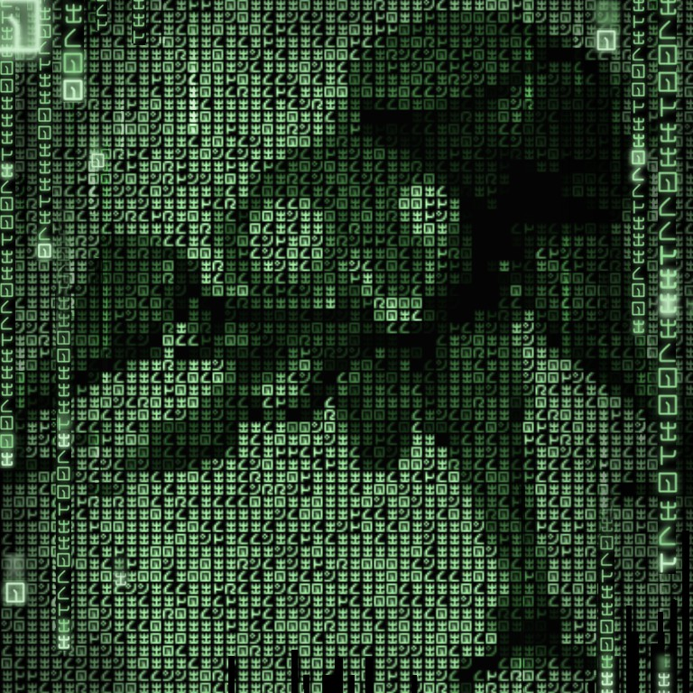
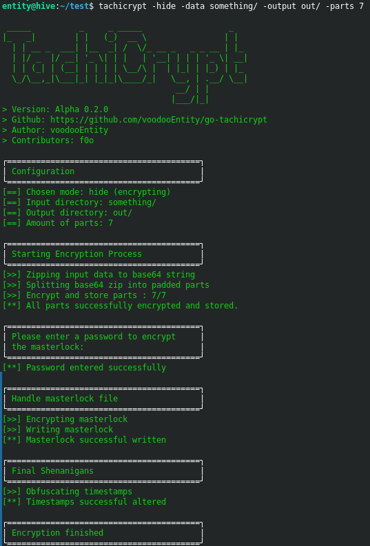
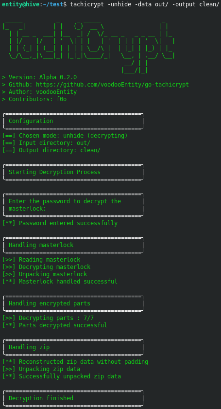

<h1 align="center">
  <br>
  <a href="https://github.com/voodooEntity/go-tachicrypt/"></a>
  <br>
  TachiCrypt
  <br>
</h1>

<h4 align="center">An experimental cli tool to encrypt & decrypt files/directories.</h4>


<p align="center">
  <a href="#key-features">Key Features</a> •
  <a href="#how-to-use">How To Use</a> •
  <a href="#screenshots">Screenshots</a> •
  <a href="#how-to-build">How To Build</a> •
  <a href="#roadmap">Roadmap</a> •
  <a href="#changelog">Changelog</a> •
  <a href="#license">License</a>
</p>

<i><b>Important</b> right now this is an experimental project and the safety and stability isn't guaranteed!</i>

## Key Features

- Clean and straightforward CLI interface.
- Supports encryption of both files and directories (with recursive functionality).
- Pure Go implementation with no external dependencies.
- Utilizes AES GCM encryption, avoiding custom or insecure encryption schemes.
- Encrypts data into multiple segments, allowing distribution across various storage locations or transfer channels.
- Each encrypted segment is assigned a random name to enhance security.
- Individual encryption keys are used for each segment, ensuring robust protection.
- A single 'masterlock' file, encrypted with a user-provided password, is used to decrypt the segments. It securely stores the passkeys and the mapping of random filenames to the original sequence.
- The encrypted segments creation/modification timestamps are altered to further obscure the data sequence.

## How to use
### Encrypt
The following command is an example on how to encrypt. The password for the masterlock will be prompted interactively.
```bash
tachicrypt -hide -data /path/to/your/file/or/directory -output /path/to/where/ecnrypted/data/and/masterlock/should/be/stored -parts INT
```
* -hide: Indicates that the data should be encrypted.
* -data: Specifies the path to the file or directory to be encrypted.
* -output: Sets the directory where the encrypted parts and masterlock file will be stored.
* -parts: Determines the number of encrypted parts to create.


### Decrypt
The following command is an example on how to decrypt. The password for the masterlock will be prompted interactively.
```bash
tachicrypt -unhide -data /path/to/your/encrypted/files/and/masterlock -output /path/to/where/the/decrypted/data/should/be/stored
```
* -unhide: Indicates that the data should be decrypted.
* -data: Specifies the path to the directory containing the encrypted parts and masterlock file.
* -output: Sets the directory where the decrypted data will be stored.

### Help
You can always use
```bash
tachicrypt --help
```
to print information about the params and example commands for encrypting and decrypting.

## Screenshots
### Encryption


### Decryption


## How to build

To clone and run this application, you'll need [Git](https://git-scm.com) and [go](https://go.dev/doc/install) installed on your computer. From your command line:

```bash
# Move to your GOPATH directory 
$ cd $GOPATH

# Create necessary directories
$ mkdir -p github.com/voodooEntity

# Move into the newly created directory
$ cd github.com/voodooEntity

# Clone this repository
$ git clone https://github.com/voodooEntity/go-tachicrypt.git

# Move to the client directory
$ cd go-tachicrypt/cmd/client

# Build the application
$ go build -o tachicrypt

# Copy the resulting binary into your gopath binary directory
$ cp tachicrypt $GOPATH/bin
```

After this steps you can use the command 'tachicrypt' on the cli wherever you are

## Roadmap
At this point i want to repeat that this is an experimental project. I got no exact timeline or plans on when i will enhance this software. I probably gonne decide this based on if there is anyone interested and actually will be using it. So if you want me to further improve it - leave a star to let me know .)

- [x] Add Changelog
- [x] Adjust password input to not show the typed text
- [x] Cli output overhaul
- [x] Implement better error handling
- [x] Remove base64 as transport between zip and AES
- [ ] Reconsider the usage of zip as transport format
- [ ] Code cleanup
- [ ] Enhance the padding at the end of uneven last parts to use random data
- [ ] Enhance the strength of generated passkeys for encryption
- [ ] Implement a check to warn the user if the gathered random data is weak 


## Changelog
***Notice: While in alpha, minor version updates may be breaking. While i will try to reduce the amount of breaking changes, it still may happen. When breaking changes are to be expected it will be informed about in the breaking versions changelog.***

[Check the Changelog](./CHANGELOG.md)

Latest Release [Alpha 0.3.0](https://github.com/voodooEntity/go-tachicrypt/releases/tag/0.3.0)


## License
[Apache License Version 2.0](./LICENSE)

---

> [laughingman.dev](https://blog.laughingman.dev) &nbsp;&middot;&nbsp;
> GitHub [@voodooEntity](https://github.com/voodooEntity)

