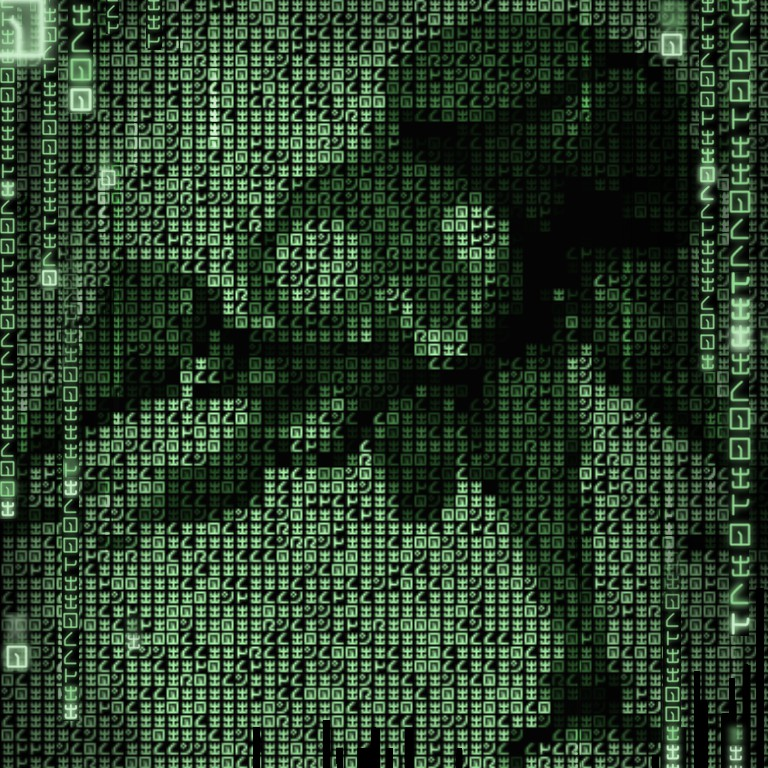

<h1 align="center">
  <br>
  <a href="https://github.com/voodooEntity/go-tachicrypt/"></a>
  <br>
  TachiCrypt
  <br>
</h1>

<h4 align="center">An experimental cli tool to encrypt & decrypt files/directories.</h4>


<p align="center">
  <a href="#key-features">Key Features</a> •
  <a href="#how-to-build">How To Build</a> •
  <a href="#how-to-use">How To Use</a> •
  <a href="#roadmap">Roadmap</a> •
  <a href="#license">License</a> •
  <a href="#changelog">Changelog</a>
</p>

<i><b>Important</b> right now this is an experimental project and the safety and stability isn't guaranteed!</i>

## Key Features

* Simple cli interface
* Supports encrypting either files or directories(recursively)
* Vanilla golang code with no dependency hell
* Uses AES GCM to encrypt and does not rely on any self implemented half baked encryption
* Encrypts into multiple parts to enable storing the encrypted data split on multiple different places or transfer the encrypted data over multiple different channels
* The encrypted parts are named using random strings to complicate cracking the data
* Each encrypted part is encrypted using another passkey
* Uses one 'masterlock' file which is also encrypted by a user provided password to decrypt the encrypted parts (contains the passkeys as well as the original order mapped to the random filenames)
* The encrypted parts are randomly named and the created/modified date are altered using random data to prevent an attacker from using those to figure out the correct sequence


## How to build

To clone and run this application, you'll need [Git](https://git-scm.com) and [go](https://go.dev/doc/install) installed on your computer. From your command line:

```bash
# Move to your GOPATH directory 
$ cd $GOPATH

# Create necessary directories
$ mkdir -p github.com/voodooEntity

# Move into the newly created directory
$ cd github.com/voodooEntity

# Clone this repository
$ git clone https://github.com/voodooEntity/go-tachicrypt.git

# Move to the client directory
$ cd go-tachicrypt/cmd/client

# Build the application
$ go build -o tachicrypt

# Copy the resulting binary into your gopath binary directory
$ cp tachicrypt $GOPATH/bin
```

After this steps you can use the command 'tachicrypt' on the cli wherever you are

## How to use
To encrypt a file or directory use the following syntax (replace INT with the amount of resulting encrypted parts you wish to have)
```bash
tachicrypt -hide -data /path/to/your/file/or/directory -output /path/to/where/ecnrypted/data/and/masterlock/should/be/stored -parts INT
```
The command will than ask you interactively for a password to encrypt the masterlock file. Input the designated password and hit enter. The tool will than encrypt the in -data defined input and write the encrypted parts as well as the masterlock to the in -output defined directory.

To decrypt the data you use the following syntax (Important - the masterlock file needs to be in the same directory as the encrypted parts)
```bash
tachicrypt -unhide -data /path/to/your/encrypted/files/and/masterlock -output /path/to/where/the/decrypted/data/should/be/stored
```
The command will than ask you interactively for the password to decrypt the masterlock. Input the password defined when encrypting and hit enter. The tool will than decrypt the in -data defined encrypted parts using the masterlock and write the decrypted data to the in -output defined directory.

You also can always use 
```bash
tachicrypt --help
```
to print information about the params and example commands for encrypting and decrypting.

## Changelog
***Notice: While in alpha, minor version updates may be breaking. While i will try to reduce the amount of breaking changes, it still may happen. When breaking changes are to be expected it will be informed about in the breaking versions changelog.***

[Check the Changelog](./CHANGELOG.md)

Latest Release [Alpha 0.2.0](https://github.com/voodooEntity/go-tachicrypt/releases/tag/0.2.0)

## Roadmap
At this point i want to repeat that this is an experimental fun project. I got no timeline or plans on when i will enhance this software. I probably gonne decide this based on if there is anyone interested and actually will be using it. So if you want me to further improve it - leave a star to let me know .)

- [x] Add Changelog
- [x] Adjust password input to not show the typed text
- [x] Cli output overhaul
- [x] Implement better error handling
- [ ] Code cleanup
- [ ] Enhance the padding at the end of uneven last parts to use random data
- [ ] Enhance the strength of generated passkeys for encryption
- [ ] Implement a check to warn the user if the gathered random data is weak (if possible :>)

## License

[Apache License Version 2.0](./LICENSE)

---

> [laughingman.dev](https://blog.laughingman.dev) &nbsp;&middot;&nbsp;
> GitHub [@voodooEntity](https://github.com/voodooEntity)

